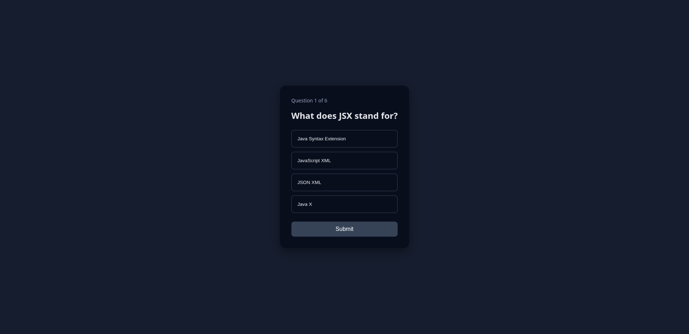

# React Quiz App

A dark-themed, responsive quiz application built with React. Users can answer multiple-choice questions, see their score, and restart the quiz. Designed mobile-first and works seamlessly across mobile, tablet, laptop, and desktop devices.

## Features

* Mobile-first responsive design
* Dark theme for modern look & accessibility
* Separate QuizScreen and ResultScreen components
* Tracks score and progress
* Submit button disabled until an answer is selected
* Restart quiz functionality
* Highlight selected answers
* Works on all screen sizes: mobile, tablet, desktop

## Tech Stack

* React (Functional Components, `useState`)
* CSS (mobile-first, responsive, dark theme)
* Optional: Can be enhanced with Tailwind or CSS Modules

## Screenshots



### Installation

```bash
# Clone the repository
git clone <https://github.com/JANS66/quiz-app>
cd quiz-app

# Install dependencies
npm install
# or
yarn install
```

### Running the App

```bash
npm start
# or
yarn start
```

* Open http://localhost:3000 in your browser
* The app will reload automatically when you make changes

## Project Structure

```
src/
├─ assets/
│  └─ questions.js       # Quiz questions data
├─ components/
│  ├─ QuizScreen.jsx     # Quiz question UI
│  └─ ResultScreen.jsx   # Result screen UI
├─ App.jsx               # Main app with state & logic
├─ App.css               # Dark theme & responsive CSS
└─ main.jsx              # Entry point
```

## Usage

1. Select an answer for each question
2. Click Submit
3. At the end, view your score
4. Click Restart Quiz to play again

## Customization

* Add more questions in `assets/questions.js`
* Adjust colors and fonts in `index.css`
* Add animations or timers for advanced features

## License

This project is open-source and free to use for learning and portfolio purposes.